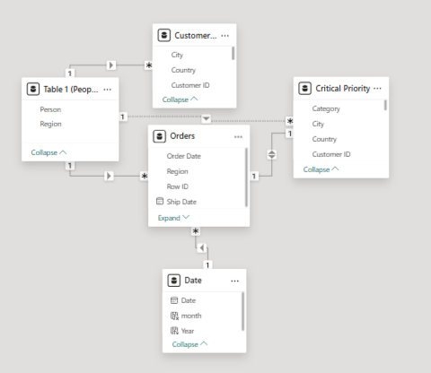
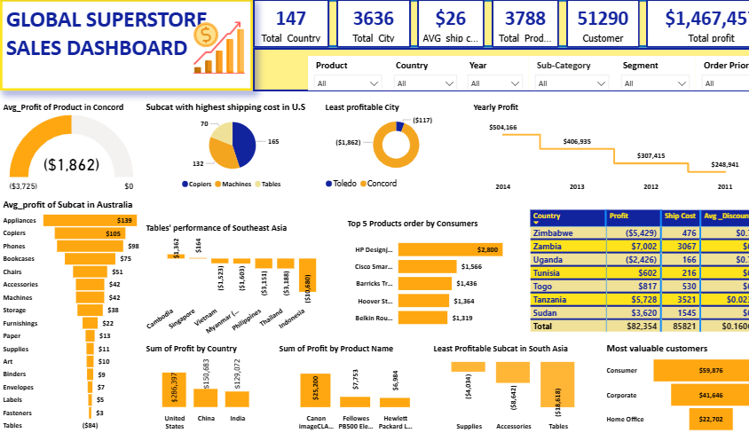

# Global-Superstore-Sales-Analysis-

## Table of Content 

- Introduction

- Data Overview

- Problem Statement

- Key Metrics

- Skills Demonstrated

- Visualization

- Tools used

- Analysis

- Data source

- Conclusion and Recommendation
  
## Introduction

Global Superstore is a global online retailer store located in the New York City aiming to be a one-stop-shop for its customers. The Global Superstore clients hailing from 147 different countries can browse through an endless offering of more than 10,000 products comprising 3 main categories which are Office supplies, Furniture and Technology.
Understanding the demand and supply of different product in each country is crucial to achieve the aim of the online store which will aid the management in making an informed decision, this analysis therefore will help make a data driven decision and recommend a possible solution that support the aim of the store and enhance productivity.

## Overview

This report analyses dataset from Global sales of Global Superstore based located in New York City. The dataset contains Orders, Product, Sales and Customer information of 51,290 customers in 147 different countries collected base on orders made between the year 2011 and year 2014.

## Problem Statement

With about 147 countries reached, the demand and supply for products by each country is unknown making it difficult to understand which product to increase or reduce the supply in each country therefore, the need to understand the profit trend to reduce loss and identify most profitable products in each country to enhance profitability and customer satisfaction globally knowing what each country needs and expanding the online store.

## Key Metrics

- The Total Profit made

- Average Shipping cost

- Total number of customers

- Total number of Country

- Total number of Cities

- Total number of products

## Skills Demonstrated

- Data Gathering

- Data Cleaning

- Data Transformation

- Data Modelling

- Data Visualization

- Quick Measure

- Dashboard Automation

- Data Gathering:
   The dataset was collected from the orders of Global online Superstore using excel sheet

- Data Cleaning and Data Transformation:
 This involve generating an informative data, changing of Date datatypes, trimming columns, reordering and adding columns using Power query. The 24 columns was divided into fact and dimension tables, creating Order table, product table and customer information making analysis easier

- Data modelling:
- This is a structural representation of data relationships, using one to many relationships, the Date table created using DAX expression in power Bi was created in relation to the order table 

- Data Visualization: This was done using power point and power bi visuals like bar chart, funnel chart, donut chart, pie chart, table matrix, Gauge, column chart, slicers, and cards to show analysis done in pictorial representation.

- Quick measure and DAX: This was used to carry out insight analysis involving statistical process, DAX expressions are formulars used to create measure, tables and other statistical measures that can not be done using quick measure.

- Dashboard Automation: This involves the use of slicers to automate the report visuals to centralise views, filter and sort the needed information while viewing the dashboard to streamline process and increase efficacy.

## Visualization

## Tools used 

- Excel sheet

- Power Bi

- Power Query

## Data source

https://docs.google.com/spreadsheets/d/1nxESpFzWjlGDMGDVLH69xmDzIl9l6OEq/edit#gid=633280281

## Analysis (Insight)

- What are the 3 countries that generated the highest total profit for Global Superstore in 2014 
In comparison to the total profit of the global superstore in the year 2014, the 3 countries with highest profit for the year are;
    - United State with a total profit of $93,508
      
    - India with total profit of $48,808 and
      
    - China with total profit of $46,794. 

- The total profit of each country was calculated using quick measures and then filtered the top 3 countries and year as slicer to filter out other years. 

- What are the 3 most profitable products in the top 3 countries of 2014
   For United State, the most profitable products are; 
     - Canon image Class 2200 Advanced copier with total profit of $15,680
     
     - Hewlett Packard Laser jet 3310 copier with total profit of $3,624
     
     - GBC Docu Bind TL300 Electric Binding system with total profit of $1,911
  For India, the most profitable products in 2014 are;
     
     - Sauder Classic Bookcase, Traditional with total profit of $2,420

     - Cisco smart phone, with caller ID having total profit of $1609

    - Hamilton Beach Refrigerator, Red with total profit of $1,440
  For China, the most profitable products are;

   - Sauder Classic Bookcase, metal with total profit of $1463

   - Bush Classic Bookcase, mobile with total profit of $1221

   - Hp copy Machine, color with total profit of $1,196

- Identify the sub categories with the highest shipping cost in the United state
   Using quick measure to calculate the average shipping cost and filtering the countries with slicer, the sub categories with the highest shipping cost in the United state are; 
Copiers with average shipping cost of $165.3, Machines with average shipping cost of $132.3 and Tables with average shipping cost of $69.95.
  Assess Nigeria’s profitability for 2014. How does it compare to other African countries 
To assess profitability of African countries, a table visual containing only the profits, shipping cost and average discount cost of each African countries was created by filtering out other countries and sorted by year 2014.
 In the year 2014, Nigeria profitability was as a high loss of $23,285 with an average shipping cost of $6 compare to other African countries minimal loss and profit.

- 4b.  What factors might be responsible for Nigeria’s poor performance
The poor performance of Nigeria profitability is likely to be as a result higher average discount rate of $0.7 on orders and higher total shipping cost of $1518 unlike good performing countries that have zero discount on orders and lesser total Shipping cost. A decrease in discount rate and shipping cost is likely to boost profitability as proven by analyses of other African countries with better performance

- Identify the product subcategory that is the least profitable in Southeast Asia
The least profitable product subcategory in southeast Asia is Tables with a negative value of $18,618.

- 5b.  Is there a specific country in Southeast Asia where Global Superstore should stop offering the   subcategory identified above
  Yes, the Global Superstore should stop offering the Tables subcategory to Malaysia because from the analysis done, it is deducted that Malaysia have zero orders of the subcategory indicating there is no demand for it in the country. The analysis was carried out using quick measure to calculate the total profit of the southeast Asia using the subcategories as filter

- Which city is the least profitable (in terms of average profit) in the United state discarding cities with orders less than 10

The least profitable city in the United state is Concord with a negative value of $1862(-$1862) 

- 6b. Why is this city’s average profit low
From the analysis, only one product with not less than 10 Orders was ordered in the city and this product falls under one of the least performing product subcategories which is Tables. The low average profit of Concord is likely to be as a result of poor order performance.

- 7.Which product subcategory has the highest average profit in Australia
Appliances have the highest average profit in Australia with an average profit of $139

8. Who are the most valuable customers and what do they buy

The most valuable customers based on critical orders and most profitable are the Consumers having total profit of $59876. Top 5 products they bought are; 

- Hp Design jet T520 inkjet large format printer-24” color with total profit of $2800
- Cisco smart phone-Full size with total profit of $1566
- Barricks training table-adjustable height with total profit of $1436
- Hoover stove-Red with total profit of $1364
- Belkin router, USB with total profit of $1319

## View my Dashboard or report here(dashboard)

## Conclusion and Recommendation 

In alignment with the Online store aim of becoming a one-stop-shop for its customers, I will say the online store has been performing well and the profitability trend in four years has been linear so far but the demand for some products are low in some countries reducing profitability. Therefore, I will recommend;

- A survey should be carried out across all countries to understand the products mostly in demand 

- The shipping cost to African countries should be reduce by providing different alternative means of delivery such as; giving customers options like Air shipping and sea shipping on the store website, this will encourage customers to make more purchase
Discount should be remove or reduce from the less profitable products to reduce loss
